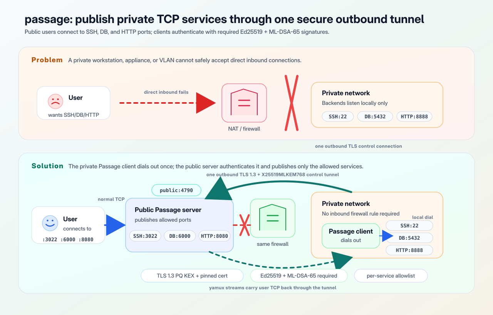

# passage

A single-port reverse TCP tunnel with mutual authentication and post-quantum
transport encryption, designed for both everyday and sensitive-data use cases.

## What is passage

`passage` exposes services from a private network (a workstation,
on-prem appliance, VLAN) on a public host by tunneling all
traffic over a single authenticated, encrypted control connection.
The public server only needs **one inbound port** for control plus
one listener per exposed service for end users. No holes are
punched in the private-network firewall.

<p align="center">
  
</p>

## Security properties

| Threat | Mitigation |
| --- | --- |
| Stolen network access without the client's private key | Server requires both an Ed25519 signature and an ML-DSA-65 signature against per-client public keys. Both must verify; this is mandatory hybrid auth (no Ed25519-only mode). |
| Server impersonation | Client pins the server's leaf certificate by SHA-256 fingerprint via `tls.Config.VerifyConnection`. No CA trust. |
| Future-quantum decryption of recorded traffic | TLS 1.3 is pinned to the hybrid post-quantum KEX `X25519MLKEM768`. Both sides set `CurvePreferences` to that curve only, and `VerifyConnection` rejects any other negotiated `CurveID`, so a classical-only peer or a future Go default change cannot silently downgrade. |
| Future-quantum forgery of client identity | The ML-DSA-65 half of the mandatory hybrid signature (`pq_pubkey` / `pq_privkey_file`) authenticates the client with a post-quantum scheme. |
| Active MitM relaying TLS to the real server | Both signatures cover the RFC-5705 TLS exporter; a relayed session yields a different exporter and fails verification. The Ed25519 signature uses domain label `passage-auth-v1`; the ML-DSA signature uses `passage-client-auth-v2` and additionally covers `requested_services`. |
| Compromised client tries to tunnel an unauthorized port | Server enforces a per-client `services:` allowlist; unknown service names abort the handshake. |
| Replay of a captured handshake | Signatures cover a 32-byte server nonce and a `client_time`; clock skew window is 60 seconds. |

Logs use `log/slog` with JSON output. **Payload bytes are never
logged**, only structured handshake/connection events
(`client_id`, `session_id`, `service`, `stream_id`, `remote`,
`err`).

## Quick start with Docker

A no-local-build way to see passage working. It pulls
`ghcr.io/jfhack/passage:latest` from the GitHub Container Registry.
The image-based variant is split into a `server/` and `client/`
directory so you can copy each to its own host; for a local demo,
run both side by side in separate shells on the same machine.

> **Tip:** if you just want to try it end to end as quickly as
> possible and have Docker available, jump straight to
> [Fastest: generate `server/` and `client/` from a single spec](#fastest-generate-server-and-client-from-a-single-spec)
> below.

Server side, in [quick/isolated-image/server/](quick/isolated-image/server/):

```sh
git clone https://github.com/jfhack/passage
cd passage/quick/isolated-image/server

./bootstrap.sh        # generates TLS cert; prompts for client id + both pubkeys
docker compose up -d  # starts the passage server
```

Client side, in [quick/isolated-image/client/](quick/isolated-image/client/):

```sh
cd passage/quick/isolated-image/client

./bootstrap.sh        # generates hybrid Ed25519 + ML-DSA-65 keys; prompts for remote + fingerprint
docker compose up -d  # starts the client + nginx backend
```

The two `bootstrap.sh` scripts print the values you need to paste
into each other (server fingerprint, client id, both client public
keys).

Then:

```sh
curl -i http://localhost:8080/
# the nginx welcome page comes back through the tunnel.
```

The client and the demo backend run on a docker network with
`internal: true` (no outbound internet), proving traffic only
flows through the passage tunnel.

A second example,
[quick/host-image/](quick/host-image/) (also split `server/` +
`client/`), shows the same idea with `network_mode: host` to expose
a host-level service like SSH.

If you'd rather build the image locally instead of pulling it, use
[quick/isolated/](quick/isolated/) or [quick/host/](quick/host/).
These are single-directory variants you can run with
`docker compose up --build`.

### Fastest: generate `server/` and `client/` from a single spec

**This is the fastest way to try passage end to end.** Requires
Docker and the `passage` binary on `PATH`. Get the binary by:

- running `sudo ./scripts/install.sh` (builds and installs it; see
  [Installing the binary](#installing-the-binary)),
- running `./scripts/build.sh` and using `./dist/passage` directly,
- or grabbing the binary from a release archive.

Instead of editing yamls and bootstrapping each side by hand, write
one **quick-docker spec** and let `passage quick-docker` generate
both sides at once: TLS cert, hybrid Ed25519 + ML-DSA-65 keypair,
fingerprint, both public keys, and ready-to-go `docker-compose.yml`
all wired up. You then just copy each directory to the matching
host.

See [quick/spec/example.yaml](quick/spec/example.yaml) for the
spec format. It declares the server's bind/public addresses, the
client id, the per-service `client:` (backend reached from the
client) and `server:` (address users connect to), plus a `mode:`
(`host` or `isolated`) for each side independently. Set
`project_name:` to give the generated Compose projects stable,
role-specific names such as `demo-passage-server` and
`demo-passage-client`, so multiple generated stacks can coexist on
the same Docker host.

```sh
passage quick-docker -out ./deploy quick/spec/example.yaml
```

This produces:

```
deploy/
├── server/   # copy to the public-facing host, then: docker compose up -d
└── client/   # copy to the private-network host, then: docker compose up -d
```

In `host` mode the side runs with `network_mode: host`; in
`isolated` mode it uses bridge networking, and on the server side
the spec's `server:` addresses are translated into compose `ports:`
mappings. `limits:` and `reconnect:` are written with the same
defaults the binary uses, so you can edit them in the generated
yaml when you need to tune them. Re-running with `-force`
regenerates both directories (new TLS cert, new Ed25519 keypair,
new ML-DSA-65 keypair).

The generated stacks are wired for hybrid auth: the server's
`pq_pubkey:` and the client's `pq_privkey_file:` are filled in,
and the client compose file mounts `client.mldsa` next to
`client.ed25519`. Hybrid auth is mandatory; there is no
Ed25519-only mode.

## Generating keys

On the **server** host:

```sh
# Self-signed TLS cert (any CN works; clients pin by fingerprint).
openssl req -x509 -newkey ed25519 -nodes \
  -subj "/CN=passage" \
  -keyout server.key -out server.crt -days 825

passage fingerprint server.crt
# sha256:<64 hex>   <-- paste into client.yaml
```

On each **client** host, generate the hybrid Ed25519 + ML-DSA-65
keypair. Both halves are mandatory; `keygen` writes both in one
shot:

```sh
passage keygen -out client.ed25519 -pq-out client.mldsa
# wrote private key: client.ed25519
# public key (paste into server.yaml as pubkey):
# ed25519:<base64>
# wrote pq private key: client.mldsa
# pq public key (paste into server.yaml as pq_pubkey):
# mldsa:<base64>
```

Both private key files are written 0600. On the server side, paste
the `ed25519:` line into the client's `pubkey:` and the `mldsa:`
line into the client's `pq_pubkey:`. On the client side, list both
files under `identity:` as `privkey_file:` and `pq_privkey_file:`.
Either side missing one of the four fields is a load-time error;
there is no Ed25519-only mode.

To rotate just the ML-DSA-65 half (for example, after a suspected
PQ compromise), run `passage pq-keygen -out client.mldsa.new` and
update `pq_pubkey` / `pq_privkey_file` accordingly.

## Configuration reference

### `server.yaml`

```yaml
listen: 0.0.0.0:5679        # control port; clients dial this once

tls:
  cert: /etc/passage/server.crt
  key:  /etc/passage/server.key

clients:
  - id: dirac-prod         # arbitrary id, must match client identity.id
    pubkey: ed25519:<b64>  # required; may be a list for key rotation
    pq_pubkey: mldsa:<b64> # required; may be a list for key rotation
    services:
      - name: dirac_ssh
        listen: 0.0.0.0:3022
        allowed_user_cidrs: [10.0.0.0/8]    # optional source-IP allowlist
      - name: postgres_med
        listen: 127.0.0.1:6000
        allowed_user_cidrs: [127.0.0.1/32]

limits:
  max_streams_per_client: 256
  handshake_timeout: 10s
  idle_timeout: 5m
  heartbeat_interval: 30s
```

### `client.yaml`

```yaml
remote: example.com:5679
server_fingerprint: sha256:<64 hex>   # from `passage fingerprint`

identity:
  id: dirac-prod
  privkey_file: /etc/passage/client.ed25519
  pq_privkey_file: /etc/passage/client.mldsa

services:                  # name -> local backend host:port
  dirac_ssh:    192.168.2.34:22
  postgres_med: 192.168.2.41:5432

reconnect:
  initial_backoff: 1s
  max_backoff: 60s
  jitter: true             # full jitter in [base/2, 3·base/2)
```

Strict validation: any unknown YAML key is a load-time error.

## Installing the binary

```sh
sudo ./scripts/install.sh
```

Builds `passage` from source via
[scripts/build.sh](scripts/build.sh) and installs it. Asks to
confirm the install prefix (default `/usr/local/bin`) and copies
the freshly built binary there with mode `0755`, overwriting any
previous install.

Requires Go on `PATH`. When the script is run via `sudo`, it
invokes the build as the original user (via `sudo -u "$SUDO_USER"
-i`) so their Go toolchain (typically under `~/go/bin` or
`/usr/local/go/bin`) is found.

## Building from source

```sh
./scripts/build.sh           # current arch -> dist/passage
./scripts/build.sh all       # cross-compile + tar.gz for the matrix:
                             #   linux/amd64, linux/arm64,
                             #   darwin/amd64, darwin/arm64,
                             #   windows/amd64
```

Build flags: `-trimpath -ldflags="-s -w -X main.version=$VERSION"`
with `CGO_ENABLED=0`. Each tarball contains the binary, `LICENSE`,
`README.md`, and `examples/`.

## CLI reference

```
passage server       -config <file>             # run server
passage client       -config <file>             # run client
passage verify       -config <file>             # dry-run reachability + auth
passage keygen       -out <ed> -pq-out <mldsa>  # generate hybrid Ed25519 + ML-DSA-65 keypair
passage pq-keygen    -out <file>                # generate ML-DSA-65 keypair only (rotation)
passage fingerprint  <cert.pem>                 # print sha256:<hex> of a cert
passage quick-docker [-out <dir>] <spec.yaml>   # generate server/+client/ stacks (hybrid)
passage version                                 # print version and exit
```

## Operational notes

- **Logs** are JSON via `log/slog` to stderr. Only connection events
  are emitted; payload bytes are never passed to the logger.
- **Key rotation**: under `clients[*].pubkey:` write a sequence of
  two keys, deploy, switch the client to the new key, then remove
  the old one. Both keys validate during the overlap.
  `clients[*].pq_pubkey:` rotates the same way and is also required
  to have at least one entry at all times.
- **Cert rotation**: after generating a new server cert, update the
  client's `server_fingerprint:`. Until you do, clients will refuse
  to connect; that is the desired behavior.
- **Heartbeats** run every `limits.heartbeat_interval`; sessions
  drop after the yamux keep-alive deadline expires.

## Threat model and limitations

Passage **does not** protect against:

- A compromised client or server host (root on either end).
- Theft of the client's Ed25519 *and* ML-DSA-65 private key files
  together (an attacker with both can impersonate the client; the
  hybrid signature only protects against compromise of one).
- Theft of the server's TLS key.
- Traffic-analysis side channels (timing, packet sizes, connection
  counts).
- Application-layer flaws in the tunneled protocol.

The threat model in scope is "an attacker with full access to the
network path between client and server, possibly including future
quantum capability against today's recordings".

Future work (intentionally out of scope today):

- Web UI / Prometheus metrics endpoint.
- HTTP/SNI-aware multiplexing on a single user-facing port.

## License

MIT. See [LICENSE](LICENSE)
